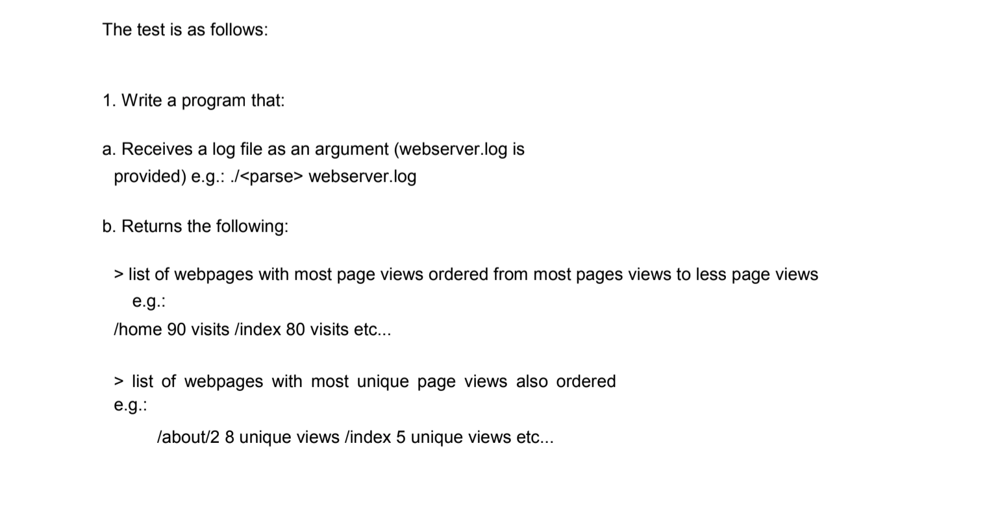
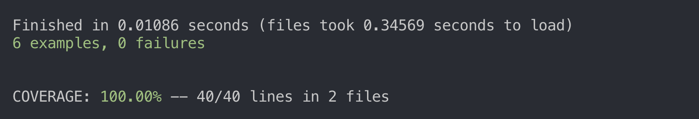

# Trainee Ruby Developer Tech Test

## Running the code 
 * cd to a directory that you would like to store the code in.
 * Enter: git clone **[git@github.com]**
 **(mailto:git@github.com)harrygalliano/SP_ruby_tech_test.git)** in the command line
 * Run: **bundle install.**
 * Run : **rspec** to see test outputs and test coverage.
 * Enter: **ruby app.rb webserver.log** to see the results.

## A brief overview on how I tackled the tech test

For me it was really important to ensure that I thoroughly stuck to my background using TDD. This helped me to avoid difficult situations where the code was breaking and I didn’t know why. 

Making sure class names and method names were related to their function also made my code much more readable and therefore easier to continue to develop. 

Refactoring is an important part of my process and helped me to mantaine good code quality whilst managing it in smaller chunks that were easier to work with.

## Testing and coverage 
I used Rspec as my testing framework for this tech test. Rspec is the ruby testing framework that I have the most experience in and I'm proud to say that I have kept in line with Smart Pension's strong ideals in TDD and have ancheived 100% test coverage (as seen in the image below). My test coverage was calculated using the Simplecov gem. 

## Technologies 
 * **ruby 2.6.0p0 (2018-12-25 revision 66547) [x86_64-darwin18]**
 * **RSpec 3.8**
 * **Simplecov** 

## Author 
Harry Galliano
